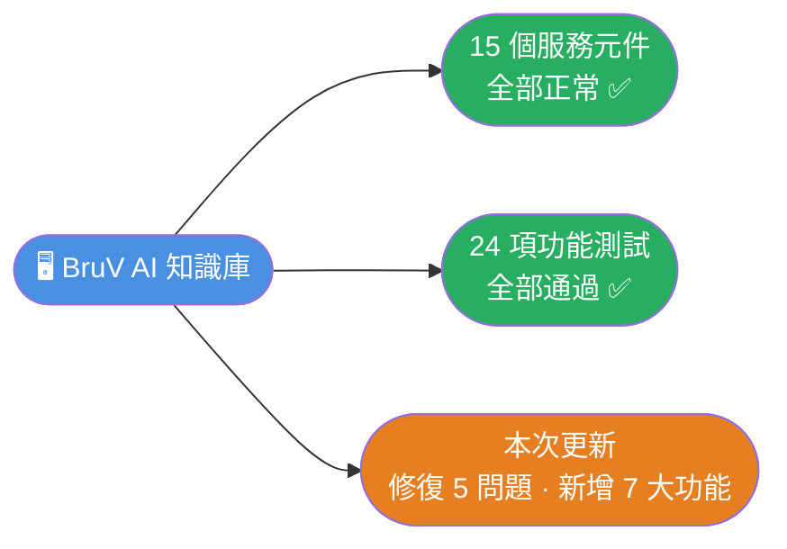
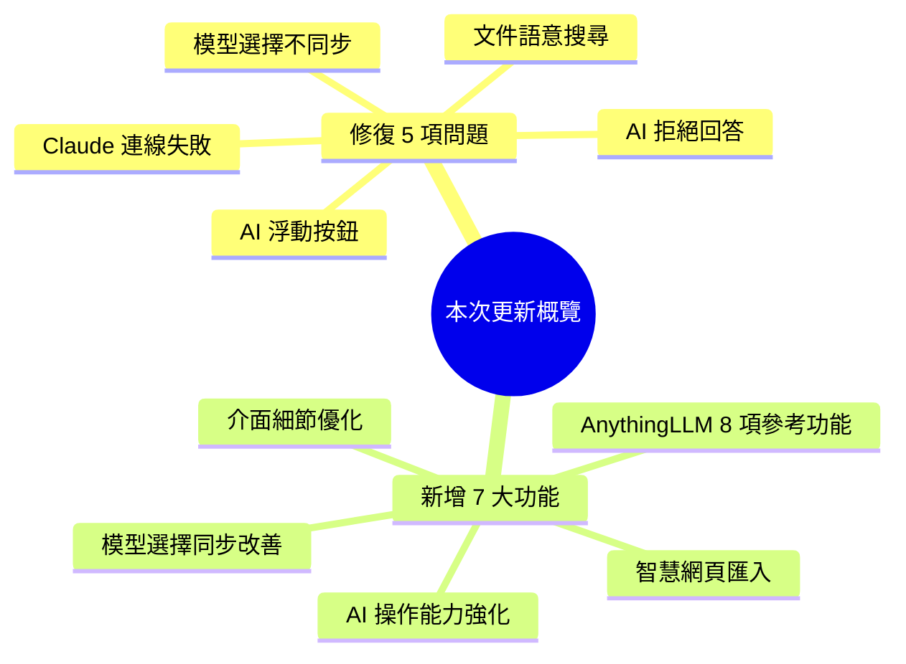
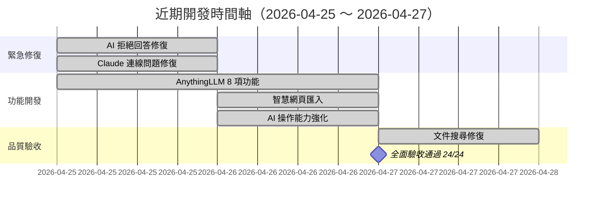

# BruV AI 知識庫系統 — 近期更新摘要

**報告日期**：2026-04-27  
**系統狀態**：✅ 正常運作中

---

## 系統現況

系統目前全部 15 個服務元件正常運作，經過 24 項功能測試，**全部通過（100%）**。

---

## 這次做了什麼

### 一、修復 AI 拒絕回答的問題

**問題**：某次功能更新後，使用者不管問什麼（包含「你好」「什麼是 AI」「台灣最高的山」），AI 都回覆「抱歉，我無法執行任何操作」。

**原因**：系統的三層限制指令相互衝突，讓 AI 誤以為「回答任何問題」都是不被允許的行為。

**結果**：已修復。AI 現在能正常回答一般問題，同時仍維持對敏感操作的保護。

---

### 二、修復雲端 AI 模型連線失敗的問題

**問題**：使用者選擇 Claude（Anthropic 的 AI 模型）進行對話時，系統顯示「LLM 服務暫時無法使用」，對話失敗。

**原因**：資料庫中 Claude 模型的設定被填錯了網址（填成了內部系統的位址），導致系統連到錯誤的地方。同時，系統在發現設定錯誤時給出的錯誤訊息太模糊，工程師難以快速定位問題。

**結果**：已修正設定，並改善錯誤訊息，未來若再發生類似問題，工程師可以立即看出是哪個模型、哪個環節出了問題。

---

### 三、新增使用者功能（參考業界標竿 AnythingLLM）

| 新功能 | 說明 |
|--------|------|
| **來源引用顯示** | AI 回答後，下方會顯示引用了哪些文件、相關程度多少，使用者可以點進去看原文 |
| **文件跳轉定位** | 點擊引用來源，可以直接跳轉到該文件中 AI 引用的那一段，方便核對 |
| **@agent 快速指令** | 在對話框輸入 `@` 可以快速選擇要使用的 AI 助理類型（頁面助理、知識庫助理、全域助理） |
| **@mention 文件引用** | 在 AI 浮動面板中輸入 `@` 可以搜尋並附加特定文件，讓 AI 針對該文件回答 |
| **知識庫工作區模式** | 進入特定知識庫後，可以讓對話範圍鎖定在該知識庫，避免 AI 混淆其他文件的內容 |
| **AI 助理個性化設定** | 使用者可以在設定頁面自訂每個頁面 AI 助理的行為指示，不需工程師修改程式碼 |
| **Prompt 模板庫** | 內建 12 種常用指令模板（寫作、翻譯、分析、摘取、程式碼、問答），一鍵套用 |
| **MCP 工具橋接** | 可透過標準化的 MCP 協定，讓外部工具直接查詢本系統的知識庫資料 |

---

### 四、智慧網頁匯入功能

**以前**：使用者只能上傳本機的 Word、PDF 等檔案。

**現在**：使用者可以直接貼上網頁網址，系統會：
1. 自動抓取網頁內容
2. 用 AI 生成文章摘要與標題
3. 建議應歸屬的知識庫與標籤
4. 使用者確認後一鍵存入並建立索引

---

### 五、AI 助理操作能力強化

- AI 現在可以在單次對話中連續執行多個操作（不再只能執行一個）
- 新增後端統一操作入口，AI 可直接建立或刪除知識庫，不再只能查詢
- 驗證了 Claude 模型的「Function Calling」功能運作正常（AI 可以主動呼叫系統工具）

---

### 六、模型選擇同步修復

**問題**：在主聊天頁面和浮動 AI 面板各自選擇不同的 AI 模型時，兩者不會互相同步，造成使用者以為選了某個模型，實際上 AI 卻用另一個模型在回答。

**結果**：已修復。現在兩處選擇的模型會即時同步，並記住上次選擇，下次開啟時不需重選。

---

### 七、介面細節改善

- 標籤管理新增右鍵選單，支援「從所有文件移除」和「徹底刪除」兩種操作，避免誤刪
- AI 助理執行操作後的結果顯示區塊，現在可以收合，不再佔滿畫面
- 修復 AI 浮動按鈕（FAB）在某些頁面不顯示的問題

---

## 本次修復的線上問題

| 問題 | 影響 | 是否已修復 |
|------|------|-----------|
| AI 拒絕回答所有問題 | 高：所有使用者均受影響 | ✅ 已修復 |
| Claude 模型對話失敗 | 高：雲端模型無法使用 | ✅ 已修復 |
| 文件語意搜尋回傳錯誤 | 中：搜尋功能無法使用 | ✅ 已修復 |
| AI 浮動按鈕不顯示 | 中：特定頁面無法使用 AI | ✅ 已修復 |
| 模型選擇不同步 | 低：使用者體驗不一致 | ✅ 已修復 |
